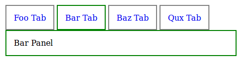
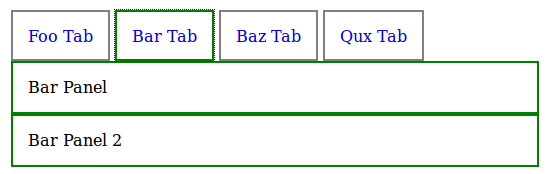

# Tabs

[![Build Status][travis-image]][travis-url]
[![Dependency Status][depstat-image]][depstat-url]
[![DevDependency Status][depstat-dev-image]][depstat-dev-url]

> Tabs for any content. RequireJS module ([Demo](https://jsfiddle.net/VovanR/novv7cy3/))

## License
MIT © [Vladimir Rodkin](https://github.com/VovanR)

[travis-url]: https://travis-ci.org/VovanR/b-tabs
[travis-image]: http://img.shields.io/travis/VovanR/b-tabs.svg

[depstat-url]: https://david-dm.org/VovanR/b-tabs
[depstat-image]: https://david-dm.org/VovanR/b-tabs.svg

[depstat-dev-url]: https://david-dm.org/VovanR/b-tabs
[depstat-dev-image]: https://david-dm.org/VovanR/b-tabs/dev-status.svg
